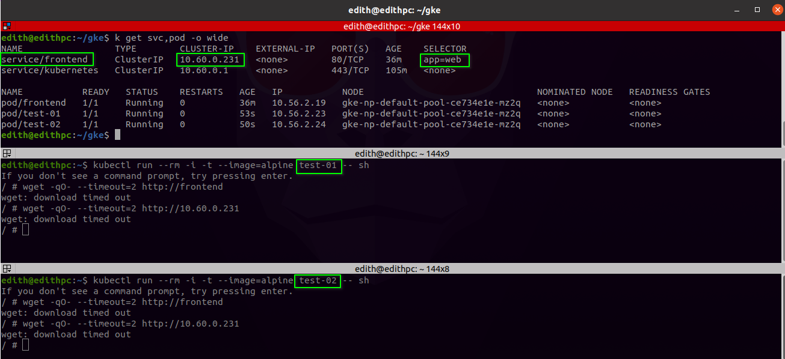

# DENY all traffic to an application


## 1. Create **prod** Namespace

```bash
~$ kubectl create namespace prod
~$ kubectl get ns

NAME              STATUS   AGE
default           Active   18m
prod              Active   5s
```
## 2. Create Pod of an application in the default Namespace.
Call it **frontend**, with labels **app=web** and expose it at port **80**:

```bash
~$ kubectl run frontend --image=nginx --labels="app=web" --expose --port=80 

service/frontend created
pod/frontend created

# List Service and Pod

~$ kubectl get svc,pod

NAME         TYPE        CLUSTER-IP    EXTERNAL-IP   PORT(S)   AGE
frontend     ClusterIP   10.60.0.231   <none>        80/TCP    3m40s
kubernetes   ClusterIP   10.60.0.1     <none>        443/TCP   72m

```

## 3. Create a second Pod in the **default** Namespace.
Call it **test-01** with no labels. Make this Pod temporary. It will request to **frontend** Service.

```bash
~$  kubectl run --rm -i -t --image=alpine test-01 -- sh

# Request to the frontend service with the name of the Service
wget -qO- http://frontend

<!DOCTYPE html>
<html>
<head>
...

# You can also, request to the frontend service with the Cluster-IP
wget -qO- http://10.60.0.231

<!DOCTYPE html>
<html>
<head>
...

```
## 4. Create a third Pod in **prod** namespace.
Call it **test-02** with no labels. Make this Pod temporary. It will also, request to **frontend** Service.


```bash
~$  kubectl run --rm -i -t --image=alpine test-02 -- sh

# Request to the frontend service with the name of the Service
wget -qO- http://frontend

<!DOCTYPE html>
<html>
<head>
...

```

We can see that Pods **test-01** and **test-02**, they can communicate with the **frontend** Service. Now we will apply a Network Police to DENY all traffic to *frontend* application.

## 5. Create a **Network Police** to deny all **ingress**.
It is necesary use the labels of the *Frontend* Pod

Create the following manifest *network-policy-default-deny-ingress.yaml*
```yaml
apiVersion: networking.k8s.io/v1
kind: NetworkPolicy
metadata:
  name: default-deny-ingress
  namespace: default
spec:
  podSelector:
    matchLabels:
      app: web
  policyTypes:
  - Ingress
```
Apply the manifest.

```bash
kubectl apply -f network-policy-default-deny-ingress.yaml

# Output
networkpolicy.networking.k8s.io/default-deny-ingress created
```
## 6. In Pods **test-01** and **test-02**.
We will send a request to **frontend** Service again.

* **Pod test-01** is in the same Namespace of the **frontend** service
```bash
kubectl run --rm -i -t --image=alpine test-01 -- sh

# Request
wget -qO- --timeout=2 http://frontend
# Output
wget: download timed out

# Request by Cluster-IP
wget -qO- --timeout=2 http://10.60.0.231
# Output
wget: download timed out
```

* **Pod test-02** is in **prod** Namespace
```bash
kubectl run --rm -i -t --image=alpine test-02 -- sh
# Request
wget -qO- --timeout=2 http://frontend
# Output
wget: download timed out

# Request by Cluster-IP
wget -qO- --timeout=2 http://10.60.0.231
# Output
wget: download timed out

```

## 7. Demo graphic

<p align="center">
  
</p>

**k exec web -it --  bash**