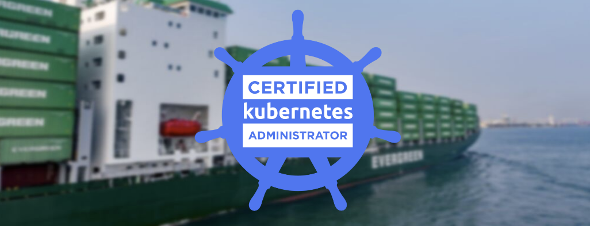

#  :octopus: Certified Kubernetes Administrator  (CKA) :dolphin:


<p align="center">
  
</p>

This repository contains definitions, tips, sources, and many commands for practice and that I am currently using to prepare for my Certified Kubernetes Administrator exam.

## **About the Certified Kubernetes Administrator (CKAD)**

CKAD 2021 Domain, Competencies & Weight

- :paw_prints: [**Cluster Architecture, Installation & Configuration (25 %)**](Cluster-Architecture-Installation-&-Configuration/Cluster-Architecture-Installation-&-Configuration.md)
- :paw_prints: **Workloads & Scheduling  (15 %)**
- :paw_prints: **Services & Networking (20 %)**
- :paw_prints: **Storage (10 %)**
- :paw_prints: **Troubleshooting  (30 %)**


Source [Training Linux Fundation](https://training.linuxfoundation.org/ckad-program-change-2021/)


# `` REPOSITORY IN PROGRESS ... `` :carousel_horse: :raising_hand:  :tractor:

```bash
cat ~/.kube/config | grep current | awk '{print $2}'
k config get-contexts -o name > /tmp/contexts

```
kubectl 

```

Manage applications
* Statefullset
kubectl 

```bash
kubectl get pods -n kube-system
```

ETCDCTL is the CLI tool used to interact with ETCD.


## Commands

```bash
kubectl taint node worker not=used:NoSchedule

ssh master
cat /etc/hosts

ls /etc/kubernetes/manifests/

systemctl status kubelet.service
systemctl restart kubelet.service

kubectl describe nodes master100 | grep -i taint
kubectl get pod -A

kubectl auth can-i create pods
kubectl auth can-i create secrets
kubectl auth can-i create configMaps
kubectl api-resoirces -o 

Security <-
```

## Switch Namespaces

```bash
kubectl config set-context $(kubectl config current-context) --namespace=dev

kubectl config set-context $(kubectl config current-context) --namespace=prod

```

## Command

k get ns | wc -l
k get ns -n research


kubectl get deploments.apps
kubectl describe deployments.apps simple-webapp-deployment | grep -i image


# Resources:

https://github.com/ahmetb/kubernetes-network-policy-recipes


## Commands

```bash
kubectl get pod --selector env=dev --no-headers | wc -l
kubectl get pod --selector bu=finance --no-headers | wc -l

# All Objects
kubectl get all --selector env=prod
# Count how many objects
kubectl get all --selector env=prod --no-headers | wc -l

# identy pod with many labels
ubectl get all --selector env=prod,bu=finance,tier=frontend

# Check if a nod ehas taints
kubectl describe node kubemaster | grep -i taints

# Create a taint on node01
kubectl taint nodes node01 spray=mortain:NoSchedule

# remove a taint from controlplane
kubectl taint nodes controlplane node-role.kubernetes.io/master:NoSchedule-

# Labels nodes
kubectl label nodes node-1 size=Large

# sho labels of a node
kubectl get node --show-labels
```

## Taints, Tolerations and Node Afinity

## Static Pods

```bash
# Look for those with -controlplaneappended in the name, They are static pods
kubectl get pods --all-namespaces
# get the path of the directory hoding the static defiition files.

ps aux | grep /usr/bin/kubelet
#Look for --config 
--config=/var/lib/kubelet/config.yaml
# Check field for static pods
grep -i staticpod /var/lib/kubelet/config.yaml
# Check how many manifest we have
ls /etc/kubernetes/manifests


```
## Multiple Schedulers
```bash
# To see schedules
kubectl get events
# Pod name that deploys the default kubernetes scheduler in this environment 
kubectl get pod --namespace=kube-system

# Get the image of the schedule
kubectl describe pod kube-scheduler-controlplane --namespace=kube-system

# Deploy an additional scheduler

```

## Metrics
```bash
minikube addons enable metrics-server
git clone https://github/kuberentes-incubator/metrics-server.git
kubectl create -f deploy/1.8+/
kubectl top node
kubectl top pod

kubectl create -f event-simulator
kubectl logs -f event-simulator-pod


```

## Rolloout and versioning
```bash
kbuectl rollout status deployment/myapp-deployment
kubectl rollout undo deployment-deployment 
#  This will ensure that no new pods are scheduled on this node and the existing pods will not be affected by this operation.
kubectl cordon node01
```
## OS Upgrades

```bash
kubectl drain node01 --ignore-daemonsets
kubectl uncordon node01
```

kubeadm - upgrade
```bash
kubeadm upgrade plan
apt-get upgrade -y kubeadm=1.12.0-00
kubeadm upgrade apply v1.12.0
apt-get upgrade -y kubeadm=1.12.0-00
kubectl restart kubelet
kubectl get nodes
kubeadm token list
kubeadm gt pods -A
cat /etc/*release*
```
# Topics
 - static pods
 - Monitoring on Kubernetes
    Prometeus
    Elastic Stack
    DataDog
    DynaTrace
- Rollout and Versioning
- OS Upgrades
